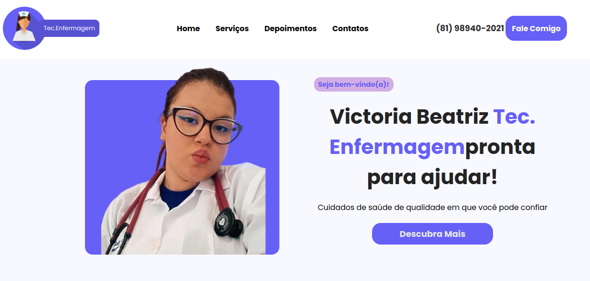

# Tecnica de Enfermagem Victoria Beatriz

## 🔥 Descrição

Criei esta Landing Page para ajudar a Victoria Beatriz, uma talentosa Técnica em Enfermagem, a divulgar seus conhecimentos e habilidades para o mundo.

O objetivo do site é:
- Apresentar a Victoria e sua trajetória profissional:
 - Experiência em diferentes áreas da enfermagem.
 - Habilidades e qualificações.
 - Diferenciais que a tornam uma profissional de destaque.
- Exibir os serviços que ela oferece:
 - Atendimento personalizado e humanizado.
 - Abordagem holística e focada nas necessidades do paciente.
 - Diversos serviços de enfermagem para diferentes públicos.

Além de divulgar o trabalho da Victoria, a Landing Page também serve como um portfólio online para o meu trabalho como desenvolvedor web Darlan Martins.

O site apresenta:

- Um design moderno e responsivo:
 - Interface amigável e intuitiva para uma ótima experiência em qualquer dispositivo.
 - Layout clean e organizado que facilita a navegação.
 - Cores e imagens que transmitem profissionalismo e confiança.
- Tecnologias web modernas:
 - Código otimizado para garantir um carregamento rápido e eficiente.
 - Segurança e confiabilidade para proteger os dados dos visitantes.
 - Acessibilidade para que todos possam ter acesso ao conteúdo do site.

## 📦 Tecnologias usadas:

* 

* 

* 

## 💡 Social

* Link para o seu linkedin [Meu linkedin](https://www.linkedin.com/in/darlan-martins-8a7956259/)